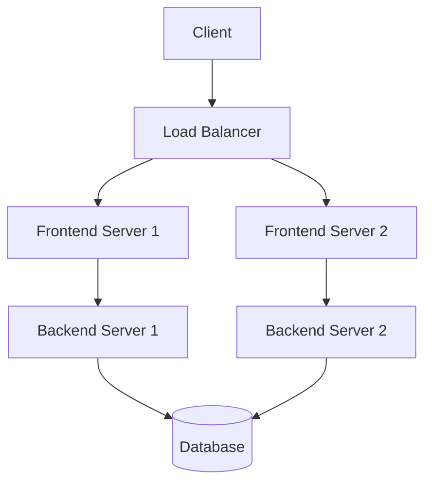

# StockTide

💰 [www.stocktide.store](https://www.stocktide.store)

모바일에 최적화된 실시간 주식 트레이딩 플랫폼입니다. 국내외 주식 거래, 실시간 차트 분석, AI 기반 투자 추천 등 다양한 금융 서비스를 제공합니다.

## 🌐 Website
- **메인 사이트**: [www.stocktide.store](https://www.stocktide.store)
- **API 문서**: [www.stocktide.store/swagger-ui.html](https://www.stocktide.store/swagger-ui.html)

## 주요 기능

- 🔄 실시간 주식 거래 (국내/해외)
- 📊 실시간 차트 분석
- 💬 실시간 채팅 서비스
- 🤖 AI 기반 투자 추천
- 💰 계좌 관리 시스템
- 📱 모바일 최적화 UI/UX
- 🌍 다국어 지원 (한국어/영어)

## 기술 스택

### Frontend
- React 18.x (Vite)
- TypeScript
- Redux-Saga
- WebSocket
- i18next (다국어)
- Styled-Components
- React-Query

### Backend
- Java 17
- Spring Boot 3.x
- JPA/Hibernate
- MySQL
- WebSocket
- JWT Security

### DevOps
- Jenkins Server  (CI/CD)
- NGINX Server
- Frontend Server 1, 2
- Backend Server 1, 2
- HTTPS/SSL
- Docker
- Load Balancer

## 시스템 아키텍처


## 프로젝트 구조
```bash
Copystocktide/
├── data_5608_20250116.xlsx
├── stocktideclient/          # 프론트엔드
└── stocktideserver/          # 백엔드
```
## 설치 및 실행

### 요구사항

* Node.js 18+
* Java 17+
* MySQL 8+
* Docker

### Frontend 실행
```bash
# 저장소 클론
git clone https://github.com/justtinCHOI/stocktide.git

# 프로젝트 디렉토리로 이동
cd stocktide/stocktideclient

# 의존성 설치
npm install

# 개발 서버 실행
npm run dev

# 프로덕션 빌드
npm run build
```
### Backend 실행
```bash
# 프로젝트 디렉토리로 이동
cd stocktide/stocktideserver

# Gradle 빌드
./gradlew build

# 서버 실행
java -jar build/libs/stocktideserver-0.0.1-SNAPSHOT.jar
```

## API 문서

Swagger UI: https://www.stocktide.store/swagger-ui.html

## 라이선스
이 프로젝트는 MIT 라이선스를 따릅니다.
### 기여하기

1. Fork the Project
2. Create your Feature Branch (git checkout -b feature/AmazingFeature)
3. Commit your Changes (git commit -m 'Add some AmazingFeature')
4. Push to the Branch (git push origin feature/AmazingFeature)
5. Open a Pull Request

## 개발자 정보

* Justin CHOI
* Email: nicola0011113@gmail.com